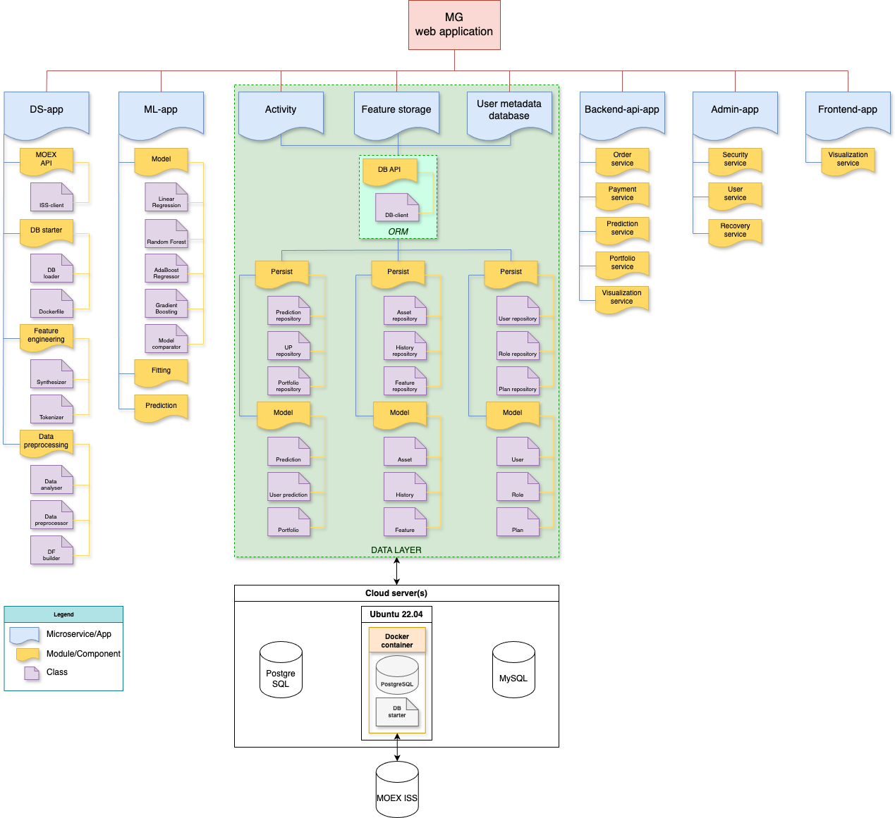

## Overview

### Магистерская диссертация. [Стартап MarketGenius.](docs/Brief.pdf)

MarketGenius — это платформа для быстрого анализа, обоснования и прогноза стоимости акций фондового рынка РФ, предназначенная для частных инвесторов.

### Артефакты проекта

* [Паспорт проекта](https://docs.google.com/document/d/1p6kL3VE8e8GuGrk0psNds25XDUINN9vB/edit?usp=sharing&ouid=117148162319140374674&rtpof=true&sd=true)
* [Описание бизнес-модели](https://docs.google.com/spreadsheets/d/1mmz1t2ehXFPm6FqgYTPvoguNe3BSK_KmouTTFAE86fY/edit?usp=sharing)
* [Архитектура сервиса и технологический стек](https://docs.google.com/document/d/1oHnVAnsTnSC0MU4f16iD9jTt_2ll0_gk/edit?usp=sharing&ouid=117148162319140374674&rtpof=true&sd=true)
* [БФТ](https://docs.google.com/document/d/1hPeGQIQJuEYPIs744Da8KPbiaM_l8_RM/edit?usp=sharing&ouid=117148162319140374674&rtpof=true&sd=true)

### Архитектура проекта

### Структура проекта

<!-- 

 -->

### ML system design

**аспекты ML System Design**

* Какова основная цель и задача вашего ML-проекта?

* Какие бизнес-требования и KPI (ключевые показатели эффективности) должна удовлетворять ваша система?

* Какие данные вы используете для обучения вашей модели?

* Каковы основные характеристики и предварительные выводы из вашего исследования данных?

* Какие алгоритмы машинного обучения вы рассматриваете и почему?

* Как вы оцениваете и сравниваете производительность различных моделей?

* Какие метрики используете для оценки качества модели?

* Как планируете проводить валидацию и тестирование модели?

* Каковы планы по интеграции модели в существующую систему?

* Какие технологии и инфраструктура используются для развертывания модели?

* Как вы планируете управлять обновлениями модели?

* Какие процедуры установлены для мониторинга и поддержания работоспособности системы на постоянной основе?

[Дополнительный материал для детального ознакомления проработки дизайна ML-системы](https://github.com/IrinaGoloshchapova/ml_system_design_doc_ru/tree/main)

## Building

TBA

## Troubleshooting

TBA

## Release Notes

Can be found in [RELEASE_NOTES](RELEASE_NOTES.md).

## Authors

* Berezhnoy Aleksakndr - [Aberezhnoy1980](https://github.com/Aberezhnoy1980)
* Suchkov Ivan
* Alidarov Timur

## Acknowledgments

TBA

## Contributing

Please, follow [Contributing](CONTRIBUTING.md) page.

## Code of Conduct

Please, follow [Code of Conduct](CODE_OF_CONDUCT.md) page.

## License

This project is Apache License 2.0 - see the [LICENSE](LICENSE) file for details
