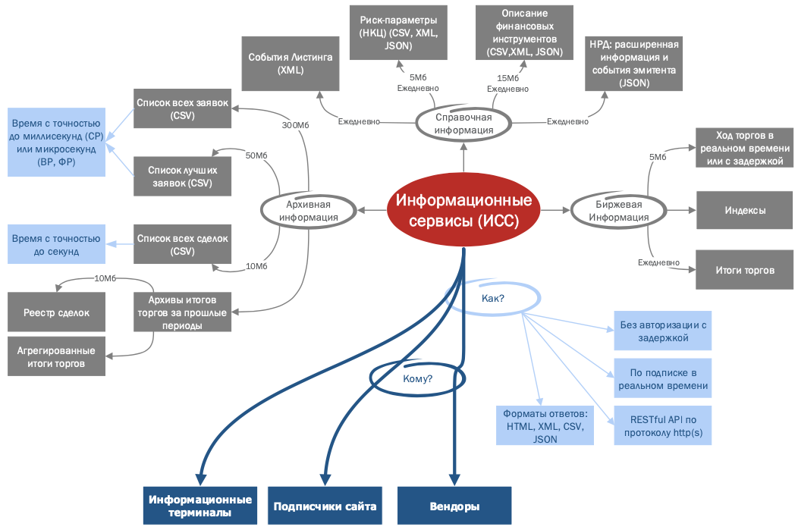
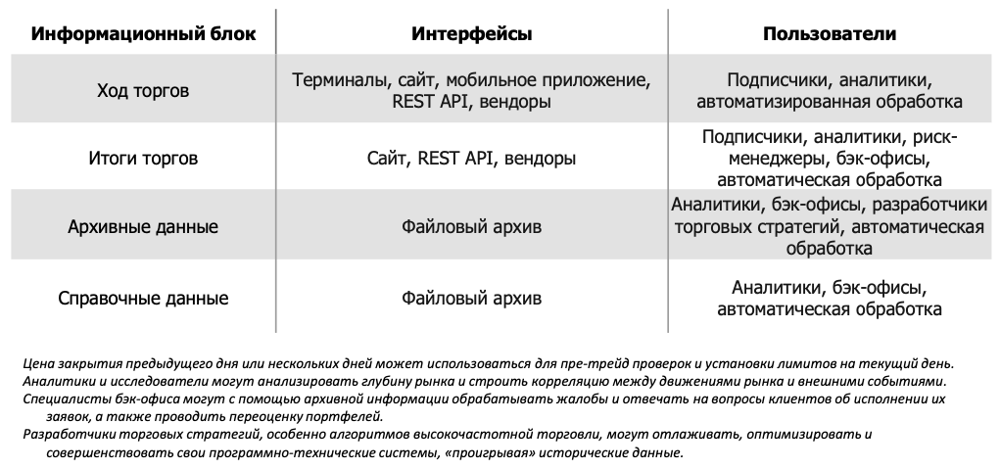
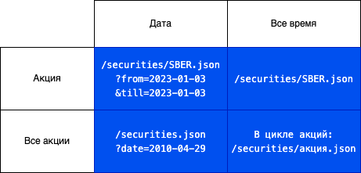
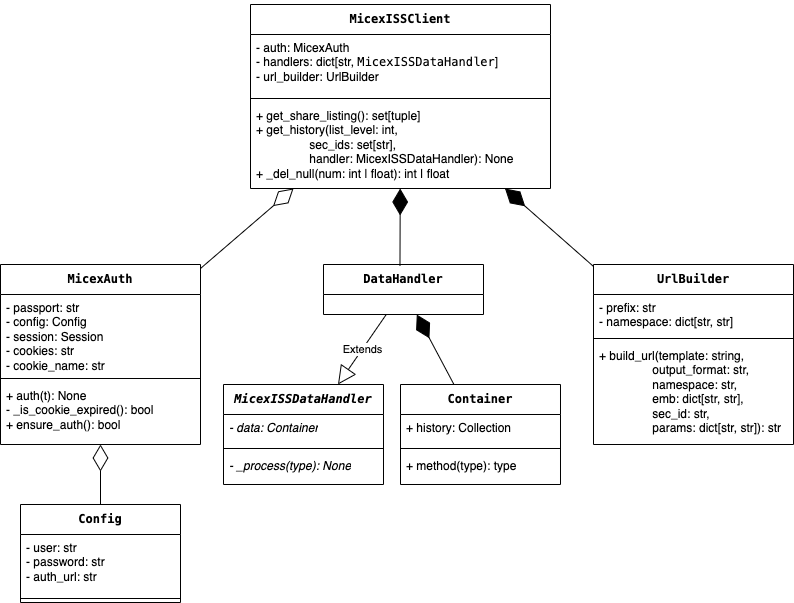

## Структура данных MOEX и логика построения запросов

### Структура ИСС



### Интерфейсы блоков ИСС



[Программный интерфейс к ИСС](https://www.moex.com/a2193)

### Авторизация

Используется basic-аутентификация, то есть имя пользователя и пароль передаются
серверу в заголовке запроса в соответствии со спецификацией.
Возможны следующие способы аутентификации:

1. По специальной ссылке по протоколу HTTPS:
   `https://passport.moex.com/authenticate`
2. По любой ссылке на ресурсы (см. справочник запросов) по протоколу HTTP.
3. При подключении без аутентификации итоги торгов и ход торгов в режиме online
   недоступны.
   При успешной аутентификации сервер возвращает cookie с именем MicexPassportCert,
   хранящей сертификат аутентификации. Cookie должен быть сохранён до указанного в
   нём времени жизни (expire) и отправляться при последующих запросах.

**Пример**

```python
# python example
import requests
from requests.auth import HTTPBasicAuth

url = 'https://passport.moex.com/authenticate'

# Basic authentication credentials
username = < login >
password = < password >

# Make a GET request with Basic Authentication
response = requests.get(url, auth=HTTPBasicAuth(username, password))

cert = response.cookies['MicexPassportCert']
```

### [Структура URL запроса](https://iss.moex.com/iss/index)

**Предметные целевые значения:**

* engines - stock. Фондовый рынок и рынок депозитов
* markets - shares. Рынок акций
* boards - TQBR. ([статья с хабр](https://habr.com/ru/articles/782260/)) Это уникальный цифровой идентификатор торговой
  площадки или режима торгов, в рамках которого проходят торги различными финансовыми инструментами. Каждой торговой
  площадке на Мосбирже присваивается свой BOARDID:

    * BOARDID=TQBR – основная площадка для акций и облигаций (Торгово-Quotation Board)
    * BOARDID=TQTF – площадка для биржевых ETF и паев ПИФов
    * BOARDID=EQBR – площадка для торговли акциями малой капитализации
    * BOARDID=FQBR – площадка для корпоративных и муниципальных облигаций и т.д.

Этот идентификатор широко используется в отчетности и API Московской биржи.

**Прочие:**

* boardgroups - группировка торговых режимов
* durations - интервалы
* securitytypes - stock_shares/1, stock_shares/2. Обычные и привилегированные акции
* securitygroups - stock_shares. Акции
* securitycollections - stock_shares_one/stock_shares_two/stock_shares_three. Группировка бумаг, например по уровню
  листинга

Уровень листинга. Listlevel – уровень листинга инструмента, соответствует котировальному списку на Мосбирже.
На Московской бирже параметр listlevel обозначает уровень листинга, то есть котировальный список, в который включены
ценные бумаги (акции, облигации).

Выделяют 3 уровня листинга:

* Первый уровень (listlevel=1) – самые ликвидные и надежные ценные бумаги крупнейших и инвестиционно-привлекательных
  эмитентов.
  Для включения есть жесткие требования.
* Второй уровень (listlevel=2) – бумаги компаний поменьше по капитализации и ликвидности. Требования мягче.
* Третий уровень (listlevel=3) – как правило, акции компаний малой капитализации и более высокого риска. Требования
  слабее.

Чем выше уровень листинга, тем выше требования к эмитенту и качество его ценных бумаг с точки зрения надежности,
информационной прозрачности и ликвидности. Все голубые фишки относятся к первому уровню листинга.

Дополнительно информация по метаданным и запросам доступна в
репозитории [moexalgo](https://moexalgo.github.io/des/realtime/#_1)
официальная библиотека Московской биржи
для [Algopack](https://www.moex.com/n70032?utm_source=www.moex.com&utm_term=ALGOPACK)

### Основные запросы для извлечения обучающих данных и принципы их формирования

Префиксом к запросам является:

```http
http://iss.moex.com/
```

Запросы принадлежат к одному из пространств имён. В текущей версии их два:

1. `/iss` – данные Торговой системы
2. `/iss/history` – данные итогов торгов

Формат, в котором необходимо получить данные, указывается в конце основной части URL через точку (перед параметрами).

Например:

```http
http://iss.moex.com/iss/history/engines/stock/markets/shares/boards/tqbr/securities.json?date=2013-12-20
```

Поддерживаются следующие форматы: XML, CSV, JSON, HTML

**Использование запросов в приложении:**

В данной версии библиотеки, клиентское приложение сфокусировано на исторических данных рынка акций Московской биржи.
Карту запросов можно представить в следующем виде:

Объекты url:

* префикс системы: `http://iss.moex.com/`
* пространство имен: `/iss/history/`
* Идентификатор рынка: `engines/stock/`
* Список рынков: `markets/shares/`
* Режим торгов: `boards/TQBR/` (опционально, если не указано - для всех режимов)

и далее



Это базовый паттерн адресов запросов для клиентского приложения, за исключением запроса для списка акации (см.ниже).
К данному шаблону можно добавлять параметры.

Далее приведены примеры основных запросов клиентского приложения.

* **Общий список активов на рынке акций биржи:**

```http
https://iss.moex.com/iss/engines/stock/markets/shares/securities.json
```

Запрос лежит в основе метода для формирования списка бумаг по типу и уровню листинга. Результатом данного служебного
метода является список, который передается в методы получения исторических данных по акциям.

* **Исторические данные на указанную дату (диапазону) по указанной бумаге по всем режимам:**

```http
https://iss.moex.com/iss/history/engines/stock/markets/shares/securities/SBER.json?from=2023-01-03&till=2023-01-03
```

Параметр `marketprice_board=1` укажет серверу отдавать данные только для главного режима торгов бумаги. Возможные
значения параметра: 1 - включить. (справочник запросов)

* **Исторические данные по указанной бумаге за все время:**

```http
https://iss.moex.com/iss/history/engines/stock/markets/shares/securities/SBER.csv?iss.only=history
```

Данный запрос возвращает данные за всю историю наблюдений по указанной бумаге в выбранном формате. Используя внешний
цикл проходящий по списку бумаг и передающий идентификатор в запрос можно получить всю историю по всем указанным бумагам
из списка. Такой подход используется потому, что нет отдельного запроса (url) для получения всей истории для всех бумаг.

Отсутствие параметра `iss.only=history` добавит в выдачу информацию о курсоре:

```json
"history.cursor": {
	"metadata": {
		"INDEX": {"type": "int64"},
		"TOTAL": {"type": "int64"},
		"PAGESIZE": {"type": "int64"}
	},
	"columns": ["INDEX", "TOTAL", "PAGESIZE"], 
	"data": [
		[0, 9104, 100]
	]
}
```

которую можно использовать, например для ограничения при обработке данных для создания csv или parquet файлов

* **Исторические данные по всем бумагам на указанную дату:**

```http
https://iss.moex.com/iss/history/engines/stock/markets/shares/boards/eqne/securities.json?date=2010-04-29
```

Для получения данных по всем режимам торгов достаточно из адреса убрать параметр (концепция формирования
ссылок базируется на архитектуре RESTful, то есть параметры передаются не только в конце строки, 
но и формируют сам URL) `boards/eqne` в примере. 

* **Исторические данные по всем (или по указанным) бумагам за все время:**

Как было описано выше, для получения всей истории для группы бумаг в клиентском приложении используется внешний цикл, 
последовательно передающий идентификаторы бумаг в адрес url для получения все истории по переданной бумаге и 
конкатенации результатов на каждой итерации.

* **Прочие запросы к серверу**

Обрабатываются пользовательскими обработчиками. Данные с сервера приходят в виде строки.

## Микросервис ds_app - сервис для работы с данными

### Сборка

1. **Виртуальная среда:**

* Установка виртуальной среды:

```shell
python3 -m venv .ds_env
   ```

* Активация:

```shell
source .ds_env/bin/acivate
```

* Проверка:

```shell
pip3 -V
``` 

* Деактивация:

```shell
deactivate
```

2. **Зависимости:**

* Установка компоновщика файла зависимостей:

```shell
pip3 install pipreqs
```

* Создание файла зависимостей

```shell
pipreqs . --ignore ".ds_env" --savepath "ds_reqs.txt" 
```

* Загрузка зависимостей в виртуальную среду

```shell
pip3 install -r ds_reqs.txt
```

### Модуль moex_api

Модуль содержит клиентское приложение для взаимодействия с информационно-статистическим сервером Московской Биржи 
(ИСС / ISS - по тексту - сервер). 

#### Архитектура клиентского приложения 



