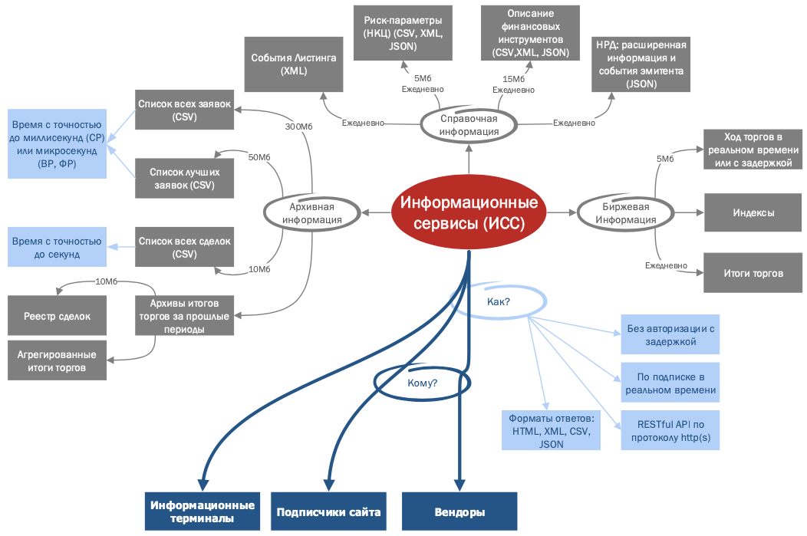
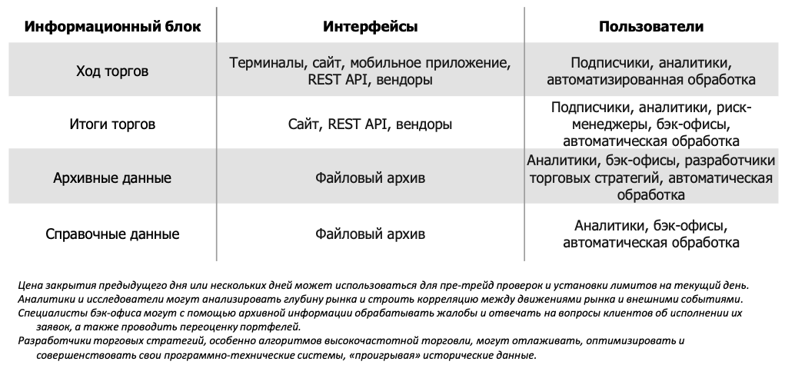
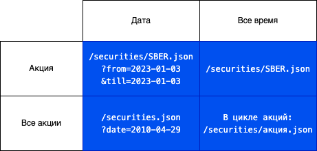
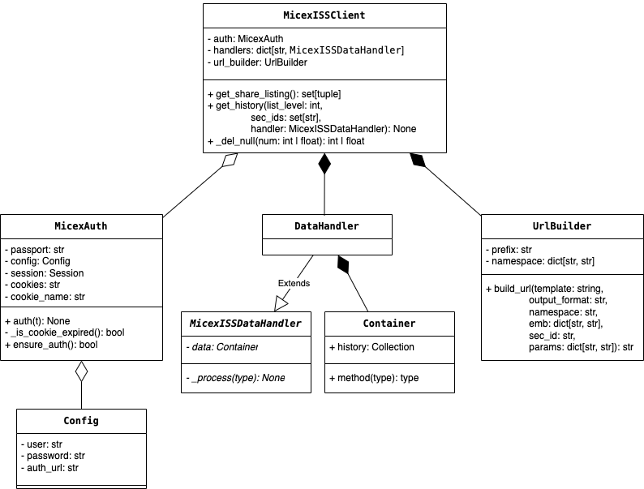

## Структура данных MOEX и логика построения запросов

### Структура ИСС



### Интерфейсы блоков ИСС



[Программный интерфейс к ИСС](https://www.moex.com/a2193)

### Авторизация

Используется basic-аутентификация, то есть имя пользователя и пароль передаются
серверу в заголовке запроса в соответствии со спецификацией.
Возможны следующие способы аутентификации:

1. По специальной ссылке по протоколу HTTPS:
   `https://passport.moex.com/authenticate`
2. По любой ссылке на ресурсы (см. справочник запросов) по протоколу HTTP.
3. При подключении без аутентификации итоги торгов и ход торгов в режиме online
   недоступны.
   При успешной аутентификации сервер возвращает cookie с именем MicexPassportCert,
   хранящей сертификат аутентификации. Cookie должен быть сохранён до указанного в
   нём времени жизни (expire) и отправляться при последующих запросах.

**Пример**

```python
# python example
import requests
from requests.auth import HTTPBasicAuth

url = 'https://passport.moex.com/authenticate'

# Basic authentication credentials
username = < login >
password = < password >

# Make a GET request with Basic Authentication
response = requests.get(url, auth=HTTPBasicAuth(username, password))

cert = response.cookies['MicexPassportCert']
```

### [Структура URL запроса](https://iss.moex.com/iss/index)

**Предметные целевые значения:**

* engines - stock. Фондовый рынок и рынок депозитов
* markets - shares. Рынок акций
* boards - TQBR. ([статья с хабр](https://habr.com/ru/articles/782260/)) Это уникальный цифровой идентификатор торговой
  площадки или режима торгов, в рамках которого проходят торги различными финансовыми инструментами. Каждой торговой
  площадке на Мосбирже присваивается свой BOARDID:

    * BOARDID=TQBR – основная площадка для акций и облигаций (Торгово-Quotation Board)
    * BOARDID=TQTF – площадка для биржевых ETF и паев ПИФов
    * BOARDID=EQBR – площадка для торговли акциями малой капитализации
    * BOARDID=FQBR – площадка для корпоративных и муниципальных облигаций и т.д.

Этот идентификатор широко используется в отчетности и API Московской биржи.

**Прочие:**

* boardgroups - группировка торговых режимов
* durations - интервалы
* securitytypes - stock_shares/1, stock_shares/2. Обычные и привилегированные акции
* securitygroups - stock_shares. Акции
* securitycollections - stock_shares_one/stock_shares_two/stock_shares_three. Группировка бумаг, например по уровню
  листинга

Уровень листинга. Listlevel – уровень листинга инструмента, соответствует котировальному списку на Мосбирже.
На Московской бирже параметр listlevel обозначает уровень листинга, то есть котировальный список, в который включены
ценные бумаги (акции, облигации).

Выделяют 3 уровня листинга:

* Первый уровень (listlevel=1) – самые ликвидные и надежные ценные бумаги крупнейших и инвестиционно-привлекательных
  эмитентов.
  Для включения есть жесткие требования.
* Второй уровень (listlevel=2) – бумаги компаний поменьше по капитализации и ликвидности. Требования мягче.
* Третий уровень (listlevel=3) – как правило, акции компаний малой капитализации и более высокого риска. Требования
  слабее.

Чем выше уровень листинга, тем выше требования к эмитенту и качество его ценных бумаг с точки зрения надежности,
информационной прозрачности и ликвидности. Все голубые фишки относятся к первому уровню листинга.

Дополнительно информация по метаданным и запросам доступна в
репозитории [moexalgo](https://moexalgo.github.io/des/realtime/#_1)
официальная библиотека Московской биржи
для [Algopack](https://www.moex.com/n70032?utm_source=www.moex.com&utm_term=ALGOPACK)

### Основные запросы для извлечения обучающих данных и принципы их формирования

Префиксом к запросам является:

```http
http://iss.moex.com/
```

Запросы принадлежат к одному из пространств имён. В текущей версии их два:

1. `/iss` – данные Торговой системы
2. `/iss/history` – данные итогов торгов

Формат, в котором необходимо получить данные, указывается в конце основной части URL через точку (перед параметрами).

Например:

```http
http://iss.moex.com/iss/history/engines/stock/markets/shares/boards/tqbr/securities.json?date=2013-12-20
```

Поддерживаются следующие форматы: XML, CSV, JSON, HTML

**Использование запросов в приложении:**

В данной версии библиотеки, клиентское приложение сфокусировано на исторических данных рынка акций Московской биржи.
Карту запросов можно представить в следующем виде:

Объекты url:

* префикс системы: `http://iss.moex.com/`
* пространство имен: `/iss/history/`
* Идентификатор рынка: `engines/stock/`
* Список рынков: `markets/shares/`
* Режим торгов: `boards/TQBR/` (опционально, если не указано - для всех режимов)

и далее



Это базовый паттерн адресов запросов для клиентского приложения, за исключением запроса для списка акации (см.ниже).
К данному шаблону можно добавлять параметры.

Далее приведены примеры основных запросов клиентского приложения.

* **Общий список активов на рынке акций биржи:**

```http
https://iss.moex.com/iss/engines/stock/markets/shares/securities.json
```

Запрос лежит в основе метода для формирования списка бумаг по типу и уровню листинга. Результатом данного служебного
метода является список, который передается в методы получения исторических данных по акциям.

* **Исторические данные на указанную дату (диапазону) по указанной бумаге по всем режимам:**

```http
https://iss.moex.com/iss/history/engines/stock/markets/shares/securities/SBER.json?from=2023-01-03&till=2023-01-03
```

Параметр `marketprice_board=1` укажет серверу отдавать данные только для главного режима торгов бумаги. Возможные
значения параметра: 1 - включить. (справочник запросов)

* **Исторические данные по указанной бумаге за все время:**

```http
https://iss.moex.com/iss/history/engines/stock/markets/shares/securities/SBER.csv?iss.only=history
```

Данный запрос возвращает данные за всю историю наблюдений по указанной бумаге в выбранном формате. Используя внешний
цикл проходящий по списку бумаг и передающий идентификатор в запрос можно получить всю историю по всем указанным бумагам
из списка. Такой подход используется потому, что нет отдельного запроса (url) для получения всей истории для всех бумаг.

Отсутствие параметра `iss.only=history` добавит в выдачу информацию о курсоре:

```json
"stocks.cursor": {
"metadata": {
"INDEX": {"type": "int64"},
"TOTAL": {
"type": "int64"
},
"PAGESIZE": {"type": "int64"}
},
"columns": ["INDEX", "TOTAL", "PAGESIZE"],
"data": [
[0, 9104, 100]
]
}
```

которую можно использовать, например для ограничения при обработке данных для создания csv или parquet файлов

* **Исторические данные по всем бумагам на указанную дату:**

```http
https://iss.moex.com/iss/history/engines/stock/markets/shares/boards/eqne/securities.json?date=2010-04-29
```

Для получения данных по всем режимам торгов достаточно из адреса убрать параметр (концепция формирования
ссылок базируется на архитектуре RESTful, то есть параметры передаются не только в конце строки,
но и формируют сам URL) `boards/eqne` в примере.

* **Исторические данные по всем (или по указанным) бумагам за все время:**

Как было описано выше, для получения всей истории для группы бумаг в клиентском приложении используется внешний цикл,
последовательно передающий идентификаторы бумаг в адрес url для получения все истории по переданной бумаге и
конкатенации результатов на каждой итерации.

* **Прочие запросы к серверу**

Обрабатываются пользовательскими обработчиками. Данные с сервера приходят в виде строки.

## ds_app - микросервис для работы с данными

### Сборка

1. **Виртуальная среда:**

* Установка виртуальной среды:

```shell
python3 -m venv .ds_env
   ```

* Активация:

```shell
source .ds_env/bin/acivate
```

* Проверка:

```shell
pip3 -V
which python
which pip
``` 

* Деактивация:

```shell
deactivate
```

2. **Зависимости:**

* Установка компоновщика файла зависимостей:

```shell
pip3 install pipreqs
```

* Создание файла зависимостей

```shell
pipreqs . --ignore ".ds_env" --savepath "ds_reqs.txt" 
```

Утилиту pipreqs лучше не устанавливать в виртуальное окружение. Установить глобально, предварительно проверив какой
пакетный менеджер вызывается (pip3 -V). Как вариант вызывать пакетный менеджер не из виртуальной среды (если она
активирована - деактивировать)

Что бы не обращаться к бинарному файлу утилиты по полному пути после перезагрузки командного интерпретатора (например
`/Users/alex/Library/Python/3.12/bin/pipreqs ...`), необходимо для нее настроить переменную PATH:

1. Определим оболочку:
   ```shell
   echo $SHELL
   ```
2. В зависимости от дефолтного интерпретатора редактируем файл конфигурации:
    * для Bash: ~/.bash_profile
    * для Zsh: ~/.zshrc
    * для Fish: ~/.config/fish/config.fish
3. Добавляем путь:
    * Для Bash или Zsh:
        ```vim 
        export PATH="PATH_TO_PIPREQS_BIN_FILE:$PATH"
        ```
        например `export PATH="/Users/alex/Library/Python/3.12/bin:$PATH"`
    * Для Fish:
        ```vim 
        set -gx PATH $PATH PATH_TO_PIPREQS_BIN_FILE
        ```
4. Применяем изменения в файле конфигурации:
    * Для Bash:
         ```shell 
         source ~/.bash_profile
         ```
    * Для Zsh:
         ```shell 
         source ~/.zshrc
         ```
    * Для Fish: перезапускаем терминал.
5. Проверяем:
    ```shell
    echo $PATH
    which pipreqs  
    ```

* Загрузка зависимостей в виртуальную среду

```shell
pip3 install -r ds_reqs.txt
```

### Модуль moex_api

Модуль содержит клиентское приложение для взаимодействия с информационно-статистическим сервером Московской Биржи
(ИСС / ISS - по тексту - сервер).

#### Архитектура клиентского приложения



#### Служебные классы

1. `Config` - класс-контейнер для параметров конфигурации
2. `MicexAuth` - класс авторизации клиента на сервере. Принимает параметры конфигурации и открывает сессию соединение. 
Клиент позволяет обрабатывать запросы и без авторизации, если сервер готов их отдать.
3. `DataHandler` - родительский класс-обработчик, содержащий абстрактный метод для обработки получаемых с сервера данных,
а также контейнер для хранения данных. Клиент содержит словарь с предустановленными обработчиками для csv, 
pandas.DataFrame и SQL, а также текстов новостей биржи. Можно добавлять пользовательские обработчики.
4. `Container` - пользовательский класс-контейнер используемый обработчиком для хранения данных. Разделяет хранение 
и/или вывод данных от обработки с целью масштабируемости.
5. `UrlBuilder` - класс-конструктор для построения GET-запроса к серверу. 

#### Клиентские методы основного класса-клиента

1. `get_history_csv` - возвращает CSV файл с историей торгов
2. `transfer_to_db` - записывает исторические данные в базу данных
3. `get_history_df` - возвращает объект pandas.DataFrame с историей торгов
4. `get_news` - записывает новости биржи в базу данных
5. `get_raw_data` - возвращает данные пользовательского запроса

#### Служебные методы клиента

1. `get_stock_exchange_list` - возвращает коллекцию тикеров, типов и уровня листинга для акций. 
2. `_get_get` - формирует GET-запрос к серверу.
3. `_get_history_cursor` - получает с сервера количественные параметры набора данных в ответе на запрос: INDEX, TOTAL 
и PAGESIZE. Позволяет управлять и контролировать размер данных для обработки.
4. `_get_list_of_stocks` - валидирует пользовательские параметры и возвращает набор акций для обхода в цикле при запросе 
истории торгов для группы акций.

#### Служебные методы модуля

1. `timer` - позволяет замерить время выполнения команд.
2. `_del_null` - заменяет пустые значения на ноль.